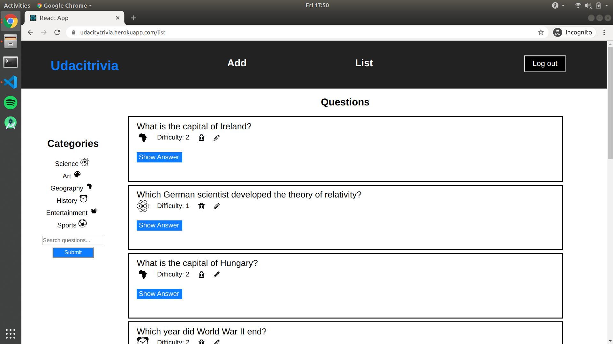
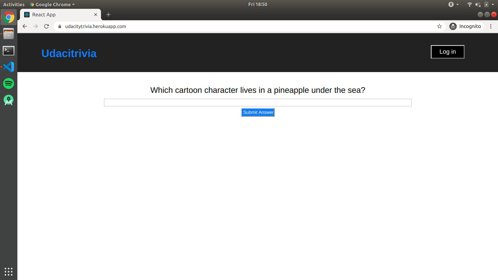
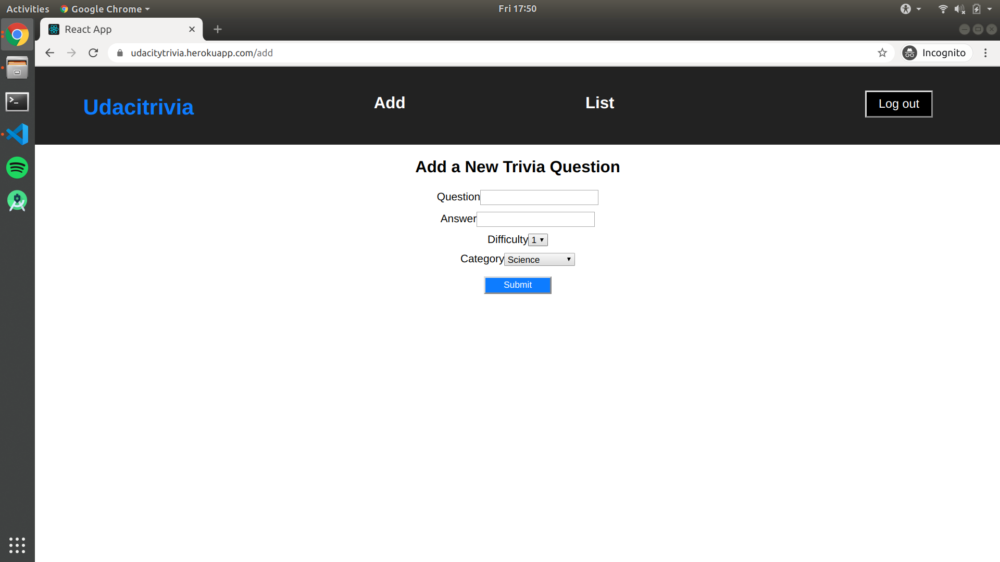

# Udacity Trivia

### Overview

Udacity Trivia is the capstone project created for the Full Stack Developer Nanodegree at Udacity. The goal of the project was to:

* Create a database using Flask-SQLAlchemy
* Create a backend API following RESTful principles
* Use Auth0 to authenticate users with JSON web tokens (JWTs)
* Use roles-based access control (RBAC) to authorize users to make API calls
* Apply test-driven development, writing unit tests for each endpoint
* Deploy the backend (and frontend) application to Heroku

Both the frontend and backend of Udacity Trivia are hosted on heroku, and are accessible at the folling URLs:

* Frontend: https://udacitytrivia.herokuapp.com/
* Backend: http://trivbackend.herokuapp.com/



### Tech stack

* **SQLAlchemy ORM** as the ORM library
* **PostgreSQL** for the database
* **Python3** and **Flask** as the server language and server framework
* **HTML**, **CSS**, and **Javascript** with **Node.js** and **React** for the frontend


### Frontend

The frontend can be visited at https://udacitytrivia.herokuapp.com/, and allows visitors to play a quiz based on a selected category of questions.



The users can also log in to access further features of the website. Two roles were setup using Auth0:
* Admin: has permission to view, add, delete and edit all questions
* Quizmaster: has permission to view questions along with their answers, but cannot modify them

After login, the navigation bar shows additional options:


Admins can add new questions in the Add tab:



The frontend uses Auth0 to authenticate users and grab the JWT with the user information (including RBAC info). The JWT is included in API calls, and verified by the backend to make sure the user has the required permissions to access the requested data.

### Backend endpoints

All endpoints accept JSON encoded requests and return JSON encoded bodies. The following endpoints were implemented to serve requests from the frontend, interacting with the database:

```/questions```
* ```GET``` request:
    * returns:
    * a paginated list of questions according to the provided ```page``` parameter
    * the total number of questions as ```total_questions,
    * the categories as ```categories```,
    * and the boolean ```success``` parameter in the body
    * example response:
      ```
      {
        "questions": [
            {
               "Question": "Who invented Peanut Butter?",
               "Answer": "George Washington Carver",
               "Category": 2,
               "Difficulty": 2
            },
            etc...
            ],
        "categories":
            {
               "1": "Science",
               "2": History",
               etc...
            },
        "success": true, 
        "totalQuestions": 13
      }
      ```
    
* ```POST``` request:
    * has 2 different functionalities: searching for questions and posting new questions
    * if ```searchTerm``` is found in the body, a list of case-insensitive search results is returned as well as the total number of results as ```totalQuestions```
    * otherwise, a new question is inserted using the provided ```questions```, ```answer```, ```difficulty```, ```category``` parameters provided and the boolean ```success``` parameter is returned in the response body
    * example response in case of searching for the term "peanut":
    ```
    {
      "questions": [
       {
         "answer": "George Washington Carver", 
         "category": 4, 
         "difficulty": 2, 
         "id": 12, 
         "question": "Who invented Peanut Butter?"
       }
     ], 
      "success": true, 
      "totalQuestions": 1
    }
    ```
    
    

---

```/questions/[int:question_id] ```
* ```DELETE``` request:
    * deletes the question with ID == ```question_id``` from the database
    * returns the boolean ```success``` parameter in the body
    
---

```/categories```
* ```GET``` request:
    * returns a list of categories with IDs and category strings in a ```categories``` parameter, such as:
    ``` 
    {
      "success": "True"
      "categories":
      {
         "1": "Science",
         "2": History",
         etc...
      }
    }
    ```
    
---

```/categories/[int:category_id]/questions```
* ```GET``` request:
    * returns:
    * a list of questions with category == ```category_id```,
    * the total number of questions as ```totalQuestions```
    * the current category as ```currentCategory```,
    * and the boolean ```success``` parameter
    * example response:
    ``` 
    {
      "success": True
      "questions": [
      {
         "Question": "Who invented Peanut Butter?",
         "Answer": "George Washington Carver",
         "Category": 2,
         "Difficulty": 2
      },
      etc...
      ],
      "totalQuestions": 5,
      "currentCategory": 2
    }
    ```
            
    
---

```/quizzes```
* ```POST``` request:
    * returns a non-recurring random question from a category based on ```quiz_category.id``` provided in the request body
    * returns the boolean ```success``` parameter in the body
    * example:
    ``` 
    {
      "success": True
      "question":
      {
         "Question": "Who invented Peanut Butter?",
         "Answer": "George Washington Carver",
         "Category": 2,
         "Difficulty": 2
      }
    }
    ```
    


### Development setup

**Virtual environment**

To start and run the local development server, initialize and activate a virtual environment:

```
$ cd trivia-backend/
$ virtualenv --no-site-packages venv
$ source venv/bin/activate
```

Install dependencies:
```
(venv) trivia-backend$ pip install -r requirements.txt
```

Key Dependencies:

* **Flask** is a lightweight backend microservices framework. Flask is required to handle requests and responses.
* **SQLAlchemy** is the Python SQL toolkit and ORM that handles the lightweight sqlite database.
* **Flask-CORS** is the extension used to handle cross origin requests from the frontend server.

**Database Setup**

With Postgres running, restore a database using the trivia.psql file provided. After creating a database called ```trivia```, from the backend folder in terminal run:

``` psql trivia < trivia.psql ```

**Running the server**
First setup all necessary environment variables:
```
trivia-backend$ source setup.sh
```

Then, to run the server, execute:

```
(venv) trivia-backend$ flask run
```

**Running the frontend**

First, install [Node.js and npm](https://nodejs.org/en/).
Then, install dependencies:
```
trivia-frontend$ npm install
```

Then, to build and run the frontend, execute:
```
trivia-frontend$ npm run build
trivia-frontend$ npm start

```

**Running the API endpoint tests**
To run the unit tests on the endpoints, run:
```
(venv) trivia-backend$ python test_flaskr.py
```
The unit tests make calls to the backend API deployed to Heroku, using test data which is deleted in the teardown function. Role-based tests are executed using the JWT tokens which are set as environment variables in ```setup.sh```.
